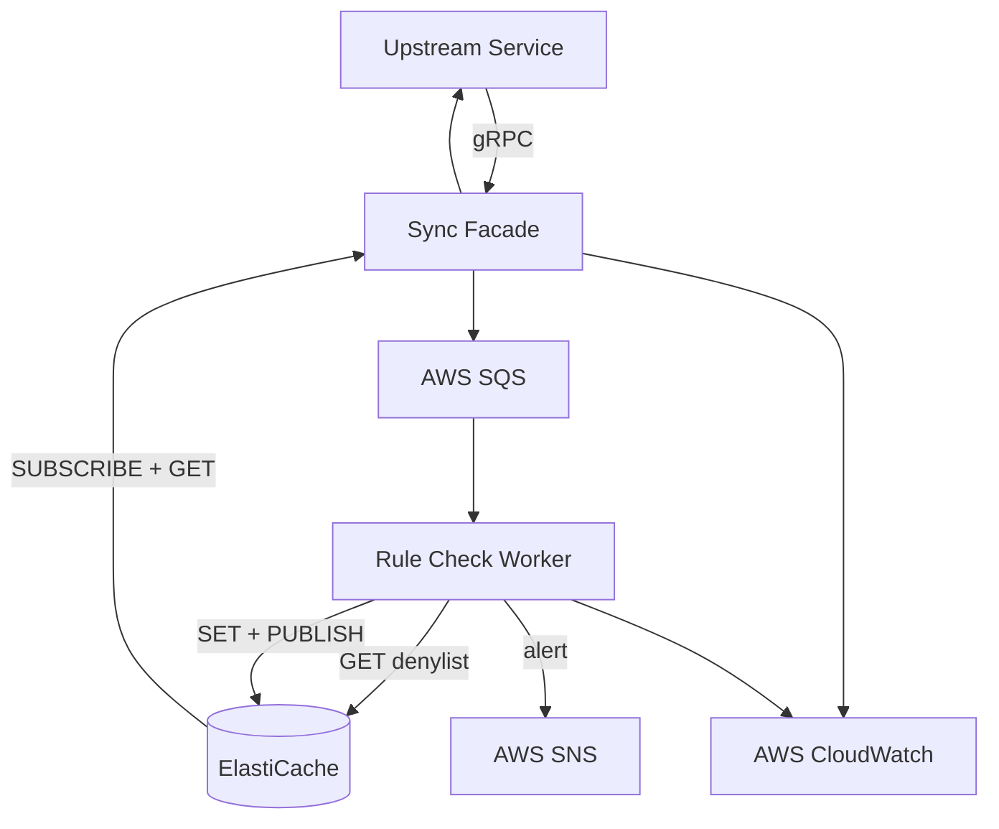

# FDS — Fraud Detection Service

Real-time fraud detection microservice built with Java, deployed on AWS EKS.

### Architecture



### Tech Stack

| Layer | Technology |
|-------|-----------|
| Language | Java 21 (Temurin) with Virtual Threads |
| Framework | Spring Boot 3.5.16 |
| gRPC | grpc-java 1.76.3 |
| Message Queue | AWS SQS (LocalStack for dev/CI) |
| Cache + Pub/Sub | AWS ElastiCache (Redis for dev/CI) |
| Logging | Fluent Bit → CloudWatch |
| Infra | Terraform |
| CI/CD | GitHub Actions + ArgoCD |
| Deployment | Kubernetes (EKS), Helm|

### Fraud Detection Rules

- **Amount Threshold**: amount > 10,000 → SUSPICIOUS
- **Denylist Match**: payee account in denylist → CONFIRMED_FRAUD


### Scripts Explanation

```
./scripts/test-all.sh              # unit/integration tests + coverage
./scripts/e2e-test.sh              # e2e tests, based on docker compose
./scripts/build-images.sh          # build docker images, push to registry
./scripts/deploy-k3d.sh            # full local deploy
./scripts/bootstrap-argocd.sh      # install ArgoCD on EKS
```

## Deployment

### AWS Infrastructure
- Terraform
- VPC, EKS, SQS, ElastiCache, CloudWatch, ECR, IAM

### K8s Cluster + Observability

| Layer | Tools |
|-------|-------|
| Cluster | k3d (local), EKS (prod) |
| Deployment | Helm |
| GitOps | ArgoCD |
| Logging | Fluent Bit → CloudWatch |
| Metrics | OTel Collector → Prometheus → CloudWatch |
| Dashboards | CloudWatch |

## Testing
### UT Test Coverage

### E2E Test Cases

### Load Test

### Resilience Test