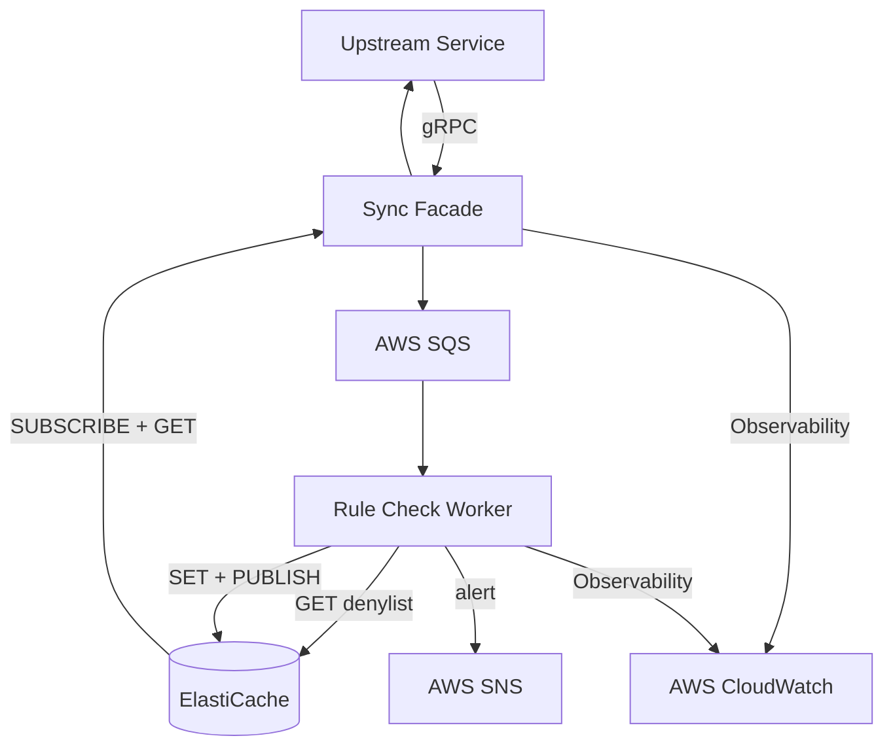

# FDS — Fraud Detection Service

Real-time fraud detection micro-service built with Java, deployed on AWS.

## Architecture



### Tech Stack

| Layer           | Technology                         |
| --------------- | ---------------------------------- |
| Language        | Java 21.0.11 (Temurin)             |
| Framework       | Spring Boot 3.5.16                 |
| gRPC            | grpc-java 1.76.3                   |
| Message Queue   | AWS SQS (LocalStack for dev/CI)    |
| Cache + Pub/Sub | AWS ElastiCache (Redis for dev/CI) |
| Observability   | AWS CloudWatch                     |
| Infrastructure  | Terraform                          |
| CI/CD           | GitHub Actions + ArgoCD            |
| Deployment      | Kubernetes (EKS), Helm             |


### Scripts Explanation

```
./scripts/test-all.sh              # unit/integration tests + coverage
./scripts/e2e-test.sh              # e2e tests, based on docker compose
./scripts/build-images.sh          # build docker images, push to registry
./scripts/deploy-k3d.sh            # full local deploy
./scripts/bootstrap-argocd.sh      # install ArgoCD on EKS
```

## Deployment

### AWS Infrastructure
- Terraform (see [`infra/README.md`](infra/README.md))
- VPC, EKS, SQS, ElastiCache, SNS, CloudWatch, ECR


### K8s Cluster + Observability

| Layer      | Tools                                    |
| ---------- | ---------------------------------------- |
| Cluster    | k3d (local), EKS (prod)                  |
| Deployment | Helm                                     |
| GitOps     | ArgoCD                                   |
| Logging    | Fluent Bit → CloudWatch                  |
| Metrics    | OTel Collector → Prometheus → CloudWatch |
| Dashboards | CloudWatch                               |

## Testing
### Uint/Integration Test Coverage
- `sync-facade`: Lines: 136/186, Instructions: 75%, Branches: 80%
- `rule-check-worker`: Lines: 125/138, Instructions: 91%, Branches: 100%

### E2E Test Cases
- Normal transaction → CLEAR
- High amount (>10,000) → SUSPICIOUS
- Denylist payee → CONFIRMED_FRAUD

### Load Test
Test using `ghz` from a dedicate EC2 instance in the VPC. 

| Metric  | Value    |
| ------- | -------- |
| Count   | 85032    |
| Total   | 180.00s  |
| Fastest | 5.17ms   |
| P10     | 103.83ms |
| P95     | 778.34ms |
| P99     | 1.14s    |
| Slowest | 8.66s    |
| RPS     | 472.40   |

### Resilience Test